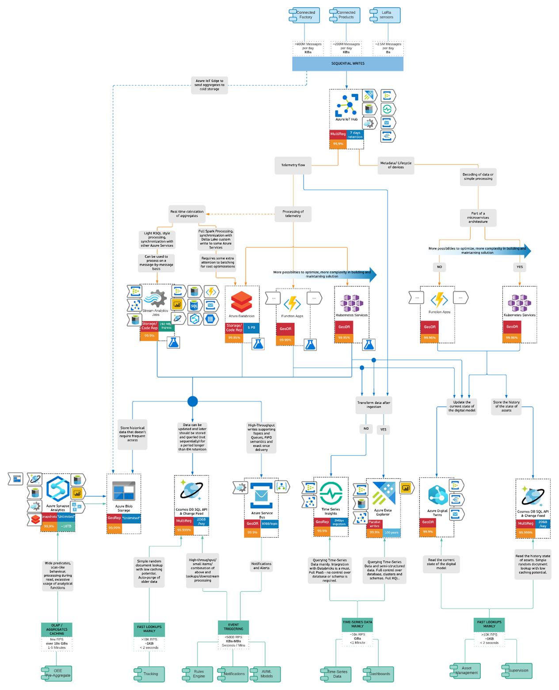
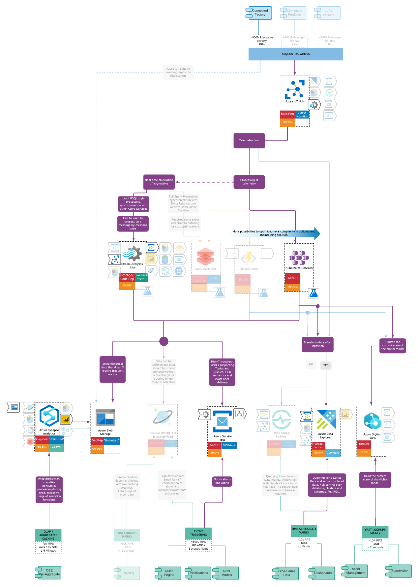
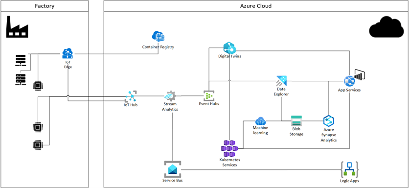

# albero-iot
## IoT Solutions Gallery Case - About

This project is the home for documenting, discussing and evolving the IoT Solution case as part of [Albero Project](https://albero.cloud/html/solutiongallery.html).
For more information about the Albero project:
- https://github.com/albero-azure/albero
- https://albero.cloud/

### Disclaimer
The Albero Decision Tree is:

- Map of the Azure Data Services with the main goal to help you to navigate among them and understand their strengths and weaknesses.
- Supplementary material to the officially published Microsoft documentation helping you to define and shape your thought process around selection of the certain data technologies and using them together in your solutions.

This Decision Tree is not:

- A Definitive Guide to selection of Data Technologies.
- Business / politics related document. All the criteria we were using are purely technical.
- Not a pattern or use-case focused document.
- Not a competitive analysis of any kind.
We are keeping some responsibility on maintaining this document as long as we can but still would recommend verifying points in the document against Microsoft official guidance and documentation.
Also do not hesitate to apply common sense and, please check things before putting into production. Not all the situations are the same / similar. 

### How to contribute
We welcome your input to further evolve the Albero IoT Solution Case: please submit your feedback and comments as a new Issue in this GitHub repo.

## How to select the data backend for your IoT projects on Microsoft Azure

Often customers and partners are overwhelmed with all the options available to them in the Azure cloud and edge platforms when starting their IoT journey. Taking the focus on data we want to clarify the options available and to do so we followed the principles of the Albero project.

Focusing on read/write patterns for data, which in IoT scenarios is mostly about streaming data at the ingestion layer, we identified 3 types of use cases which we used to complete the actual decision tree:
- __Connected Factory__ or Digital Factory data coming from quite different types of machines in a typical industrial environment. Often in these cases we also have data ingested from sensors that are added to machines and the environment. With the breadth of machine and sensor data, data ingestion volumes can grow up to large numbers.
- __Connected Product__: this scenario assumes a product is sold onto a B2B or B2C environment, but the key thing around data writes is the assumption we’d have around 200 million messages ingested per day. 
- __Low power/LoRaWAN__ types of sensors: this scenario is where devices are very low powered and send data in size of bytes, a few times per day.
When we look at these types of use cases, the actual domain of the use case has less influence than the data write, processing and read patterns including frequency, sizes of messages and latency requirements. So going forward when building the decision tree, we focused fully on the patterns but still referred to our use cases to validate our decision tree was applicable. 

To help you navigate, the decision tree consists of three layers: The blue for the write path, the yellow layer for the processing, and the green layer that shows how the data is read and consumed. 

__Interactive mode__

We recommend you use the tree in the interactive mode through the [Albero Project IoT Solution](https://albero.cloud/html/solutiongallery.html). Through the interactive view you will be able to click through to the detailed documentation about many of the service features.

__Important Note:__  

With this decision tree we focus on the data patterns and show the Microsoft Azure first-party service options without being prescriptive about the choices. This decision tree offers a non-biased view of the options, based on the customer’s technical and functional requirements. Different read and write patterns will result in different architectural decisions.

Final choices often depend on application data requirements, size, preference, and expertise of the team developing and maintaining the application with certain of the technologies. For instance, some customers might decide to consolidate all data in Azure Synapse for analytics but knowing there are also dedicated services for more real-time type of use cases like leveraging Time Series Insights or Azure Data Explorer might offer new insights. 

The reason we focused on first-party Azure PaaS services is because of the advantages around the services being managed for you, often with a pay-per-use model, offering extensive scale up and scale out options and geo-distribution.
Our choice for focusing on the Azure first-party services does not remove the fact that there are many other options available on Azure by leveraging open source and third-party solutions. Because of the overwhelming choice in this domain, we decided not to include it in an Azure based decision tree.

Another important point is the fact that IoT applications are much more than data reads and writes. A lot of the complexity comes through the requirements for having a device management solution, bi-directional communication patterns and processing to control how devices behave. This decision tree does by no means consider any of these aspects of the architecture, other than we leverage Azure IoT Hub as the IoT gateway which allows you to cover a number of these requirements. Having chosen Azure IoT Hub as our ingest pipe, allows us to ensure IoT applications will benefit from functionalities not only for data ingest pipe but also many of the requirements to build out a secure and scalable IoT application. 

We also don’t document how for instance in the case of Industrial scenarios customers will benefit from solutions like Azure IoT Edge for edge intelligence and processing, as well as store-and-forward features.

For more information about end-to-end IoT reference architecture guidance we recommend reviewing Microsoft’s architecture center article: [Azure IoT reference architecture - Azure Reference Architectures | Microsoft Docs](https://docs.microsoft.com/en-us/azure/architecture/reference-architectures/iot).

__Connected Factory example__

Let’s see how we can leverage the IoT Decision tree to populate an architecture for one of our customers in the manufacturing sector. The customer needs to capture streaming data from the factory environment, push to the cloud and further process to supply both near-real-time as well as aggregated historical data.
On the factory side, we leverage Azure IoT Edge as the intelligent gateway. This allows us to capture data from OPC UA Servers, PLCs and sensors that are directly aggregated in the edge. Optionally some sensors might connect directly with the IoT gateway in the cloud.

Azure IoT Edge itself is also downloading containerized applications from Azure Container Registry. Note we don’t cover the edge details in this discussion which would also allow for remote control and local processing.

On the cloud side, we examine the write and read profiles for the telemetry data.

For the write, things are straight-forward: we need to ingest streaming telemetry data so we will leverage Azure IoT Hub as the IoT gateway. 

Once the data is ingested, we have different read requirements that we’ll see separately:

-	Alerts for systems and people

To generate alerts and notifications we will leverage Service Bus and Logic Apps. As the process layer between the write and read path, we will use a complex event processor, Azure Stream Analytics, to transform the data and apply time-based rules.

-	Provide a knowledge graph of the factory environment and manage the current state of the machine data.

For this we will use Azure Digital Twins. The updates and queries to the assets will run in an AKS cluster. 

-	Store and analyze historical telemetry time-series data

The time-series data, will be stored to Azure Data Explorer as it allows management of the schema. The data will be ingested from Azure Stream Analytics leveraging Event Hub.  

-	Allow data scientists to explore the collected data and build machine learning algorithms which can then be used to do real time or batch scoring for things like forecasting, anomaly detection and predictive maintenance and offer data ready to be consumed via custom UI applications and Power Bi reports.

Data is forwarded into a durable, cold storage solution into Azure Storage. This will be used by Azure Synapse Analytics for data analysis and serving PowerBI reports to users. It will also be used by Azure Kubernetes Services to host a series of micro-services for Machine Learning algorithms inferencing and APIs for interaction with the UI layer. 

So, after all, we would end up in the following architecture. 

__Closing__

We hope the decision tree can be of value when you are evaluating services to be used for your architecture. 

